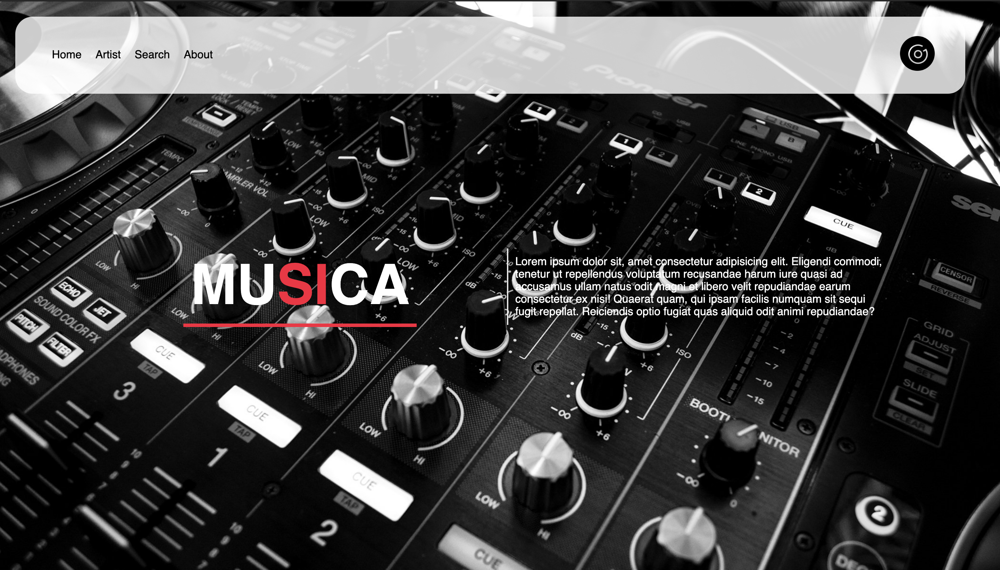
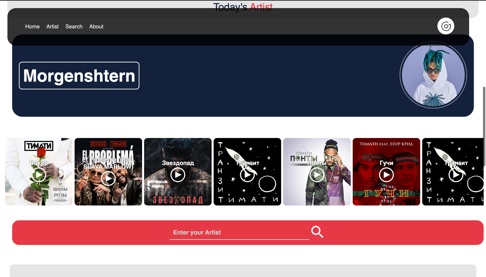
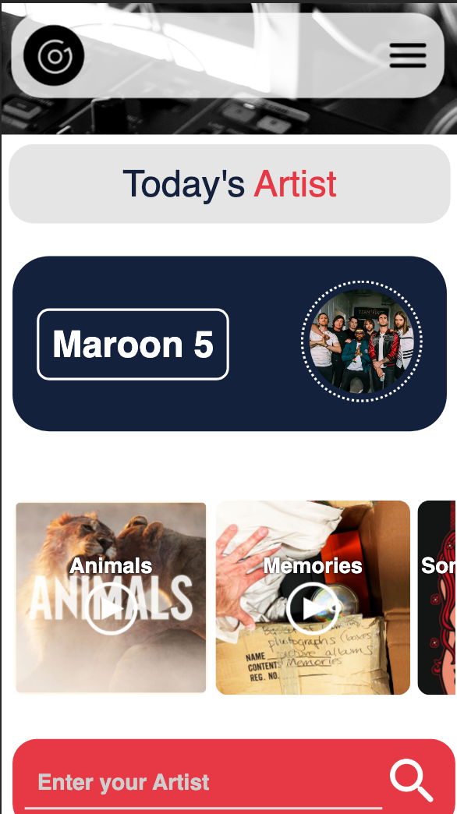

# Musica App

##### This is an application which uses an API which fetches our results for artist which we type in the search box and this will fetch all the songs of that particular artist.

## API used
### Deezers Dev API

##### This application works perfectly on all the devices from laptops to desktops to phones.
## Desktop

## Mobile

#### All the icons are taken from iconscout
#### The illustration is taken from undraw
#### The background is taken from pexels
